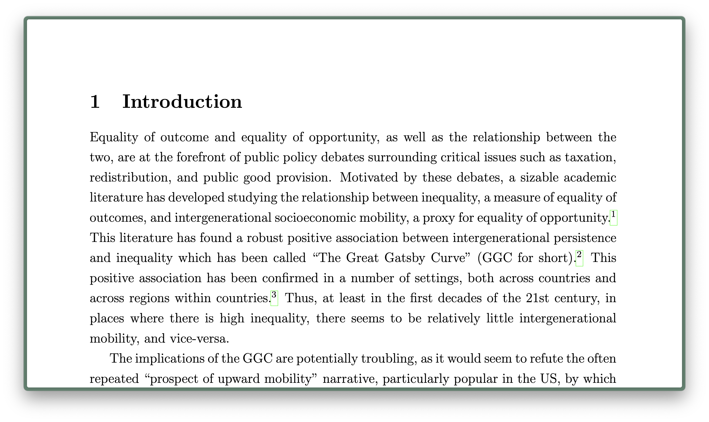

# minimalPDF

Remove toolbar and unnecessary distraction when reading a pdf document.
Works in Zen and Firefox.

### Step 1. 

In Zen, go to `about:support` in a new tab.

Find where `Profile Folder` is located, under the header **Application
Basics**. It should look something like 
```bash
/Users/username/Library/Application Support/zen/Profiles/foobar.Profile x
```
Take note of this location.

### Step 2.

Go to Terminal. Change directory into the location found in Step 1.
```bash
cd /Users/username/Library/Application Support/zen/Profiles/foobar.Profile
x
```

### Step 3.

Inside this folder, if the folder does not exist already, create a folder 
`chrome`.
You can do this as follows:
```bash
mkdir -p chrome
```
Change directory into `chrome` 

### Step 4.

Create a file called `userContent.css` in the editor of your choice.
E.g.,
```bash
vim userContent.css
```
Paste the following:
```css
#outerContainer #mainContainer div.toolbar {
  display: none !important;
}

#outerContainer #mainContainer #viewerContainer {
  top: 0 !important;
}

#outerContainer #sidebarContainer {
  display: none !important;
}

#outerContainer.sidebarOpen #viewerContainer,
#outerContainer #viewerContainer {
  left: 0 !important;
}
```

### Step 5.

Go to Zen. In a new tab, open `about:config`. Paste this into the search
bar: 
```
toolkit.legacyUserProfileCustomizations.stylesheets
```
If it is set to false, double click it to set to **true**.

Finally, **quit Zen**.

### Step 6.

You are good to go. Open a `.pdf` file inside Zen, and it should look 
something like this:


